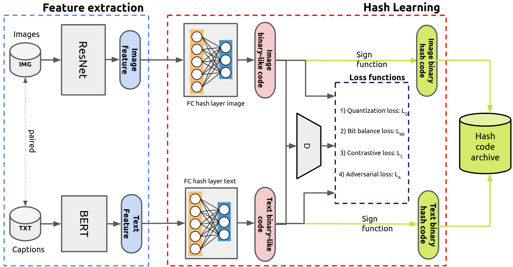

# Deep Unsupervised Cross-Modal Contrastive Hashing in Remote Sensing

> G. Mikriukov, M. Ravanbakhsh, and B. Demіr, "Unsupervised Contrastive Hashing for Cross-Modal Retrieval in Remote Sensing", IEEE International Conference on Acoustics, Speech and Signal Processing (ICASSP), 2022.

> G. Mikriukov, M. Ravanbakhsh, and B. Demіr, "Deep Unsupervised Contrastive Hashing for Large-Scale Cross-Modal Text-Image Retrieval in Remote Sensing",  arXiv:1611.08408, 2022.

If you use the code from this repository in your research, please cite the following paper:

```
@inproceedings{duch2022icassp,
  title={Unsupervised Contrastive Hashing for Cross-Modal Retrieval in Remote Sensing},
  author={G. {Mikriukov} and M. {Ravanbakhsh} and B. {Demіr}},
  booktitle={IEEE International Conference on Acoustics, Speech and Signal Processing (ICASSP)},
  year={2022}
} 

@article{duch2022,
  title={Deep Unsupervised Contrastive Hashing for Large-Scale Cross-Modal Text-Image Retrieval in Remote Sensing},
  author={G. {Mikriukov} and M. {Ravanbakhsh} and B. {Demіr}},
  url={https://arxiv.org/abs/2201.08125},
  journal={arxiv:1611.08408},
  year={2022}
} 

```

## Structure



---

## Requirements

* Python 3.8
* PyTorch 1.8
* Torchvision 0.9
* Transformers 4.4

Libraries installation:
```
pip install -r requirements.txt
```

---

## Data

[Augmented and non-augmented image and caption features](https://tubcloud.tu-berlin.de/s/DykEC54PxRM93TP) for UCMerced and RSICD datasets encoded with ResNet18 and BERT respectively. Insert them to `./data/` folder.


---

## Configs

`./configs/base_config.py`

Base configuration class (inherited by other configs):
* CUDA device
* seed
* data and dataset paths

`./configs/config_img_aug.py`

Image augmentation configuration:
* image augmentation parameters
* augmentation transform sets

`./configs/config_txt_aug.py`

Text augmentation configuration:
* text augmentation parameters and translation languages
* augmentation type selection

`./configs/config.py`

DUCH learning configuration:
* learning perparameters
* learning data presets

---

## Data augmentation

### Image augmentation

```
images_augment.py [-h] [--dataset DATASET_NAME] [--img-aug IMG_AUG_SET]
                         [--crop-size CROP_H CROP_W]
                         [--rot-deg ROT_DEG_MIN ROT_DEG_MAX]
                         [--blur-val KERNEL_W KERNEL_H SIGMA_MIN SIGMA_MAX]
                         [--jit-str JITTER_STRENGTH]

optional arguments:
  -h, --help            show this help message and exit
  --dataset DATASET_NAME
                        ucm or rsicd
  --img-aug IMG_AUG_SET
                        image transform set: see 'image_aug_transform_sets'
                        variable for available sets
  --crop-size CROP_H CROP_W
                        crop size for 'center_crop' and 'random_crop'
  --rot-deg ROT_DEG_MIN ROT_DEG_MAX
                        random rotation degrees range for 'rotation_cc'
  --blur-val KERNEL_W KERNEL_H SIGMA_MIN SIGMA_MAX
                        gaussian blur parameters for 'blur_cc'
  --jit-str JITTER_STRENGTH
                        color jitter strength for 'jitter_cc'
```

Examples:

1. No augmentation (only resize to 224x224)
```
images_augment.py --dataset ucm
```

2. Only center crop with default parameters (200x200 crop)
```
images_augment.py --dataset ucm --img-aug center_crop_only
```

3. Augmented center crop setup (crop, gaussian blur and rotation)
```
images_augment.py --dataset ucm --img-aug aug_center --crop-size 200 200 --rot-deg -10 -5 --blur-val 3 3 1.1 1.3 
```

4. Random augmentation for each image (one of following: `rotation_cc` - rotation + center crop, `jitter_cc` - jitter + center crop, `blur_cc` - blur + center crop)
```
images_augment.py --dataset ucm --img-aug each_img_random
```

### Text augmentation

#### Augmentation

Augments raw sentences from dataset's JSON-file. Augmented sentences are inserted into the same file under other tags (`aug_rb`, `aug_bt_prob`, `aug_bt_chain` for rule-based, backtranslation and chain backtranslation respectively).
Check `./configs/config_txt_aug.py` for 
```
captions_augment.py [-h] [--dataset DATASET_NAME]
                           [--txt-aug TXT_AUG_TYPE]

optional arguments:
  -h, --help            show this help message and exit
  --dataset DATASET_NAME
                        ucm or rsicd
  --txt-aug TXT_AUG_TYPE
                        image transform set: 'rule-based', 'backtranslation-
                        prob', 'backtranslation-chain'
```

Example:
```
captions_augment.py --dataset ucm --txt-aug rule-based
```

#### Embedding

Embeds captions (`raw`) and augmented captions (`aug_rb`, `aug_bt_prob`, `aug_bt_chain`) consequently.
```
captions_embed.py [-h] [--dataset DATASET_NAME]

optional arguments:
  -h, --help            show this help message and exit
  --dataset DATASET_NAME
                        ucm or rsicd
```

Example:
```
captions_embed.py --dataset ucm
```

---

## Learning

```
main.py [-h] [--test] [--bit BIT] [--model MODEL] [--epochs EPOCHS]
               [--tag TAG] [--dataset DATASET] [--preset PRESET]
               [--alpha ALPHA] [--beta BETA] [--gamma GAMMA]
               [--contrastive-weights INTER INTRA_IMG INTRA_TXT]
               [--img-aug-emb IMG_AUG_EMB]

optional arguments:
  -h, --help            show this help message and exit
  --test                run test
  --bit BIT             hash code length
  --model MODEL         model type
  --epochs EPOCHS       training epochs
  --tag TAG             model tag (for save path)
  --dataset DATASET     ucm or rsicd
  --preset PRESET       data presets, see available in config.py
  --alpha ALPHA         alpha hyperparameter (La)
  --beta BETA           beta hyperparameter (Lq)
  --gamma GAMMA         gamma hyperparameter (Lbb)
  --contrastive-weights INTER INTRA_IMG INTRA_TXT
                        contrastive loss component weights
  --img-aug-emb IMG_AUG_EMB
                        overrides augmented image embeddings file (u-curve)
```

Examples:

1. Train model for 64 bits hash codes generation using UCM dataset and default data preset
```
main.py --dataset ucm --preset default --bit 64 --tag my_model
```

2. Run test for the model from previous example
```
main.py --dataset ucm --preset default --bit 64 --tag my_model --test
```

---

## License

The code is available under the terms of MIT license:

```
Copyright (c) 2021 Georgii Mikriukov

Permission is hereby granted, free of charge, to any person obtaining a copy
of this software and associated documentation files (the "Software"), to deal
in the Software without restriction, including without limitation the rights
to use, copy, modify, merge, publish, distribute, sublicense, and/or sell
copies of the Software, and to permit persons to whom the Software is
furnished to do so, subject to the following conditions:

The above copyright notice and this permission notice shall be included in all
copies or substantial portions of the Software.

THE SOFTWARE IS PROVIDED "AS IS", WITHOUT WARRANTY OF ANY KIND, EXPRESS OR
IMPLIED, INCLUDING BUT NOT LIMITED TO THE WARRANTIES OF MERCHANTABILITY,
FITNESS FOR A PARTICULAR PURPOSE AND NONINFRINGEMENT. IN NO EVENT SHALL THE
AUTHORS OR COPYRIGHT HOLDERS BE LIABLE FOR ANY CLAIM, DAMAGES OR OTHER
LIABILITY, WHETHER IN AN ACTION OF CONTRACT, TORT OR OTHERWISE, ARISING FROM,
OUT OF OR IN CONNECTION WITH THE SOFTWARE OR THE USE OR OTHER DEALINGS IN THE
SOFTWARE.
```

